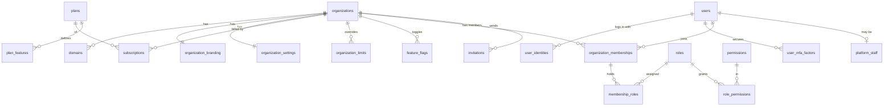
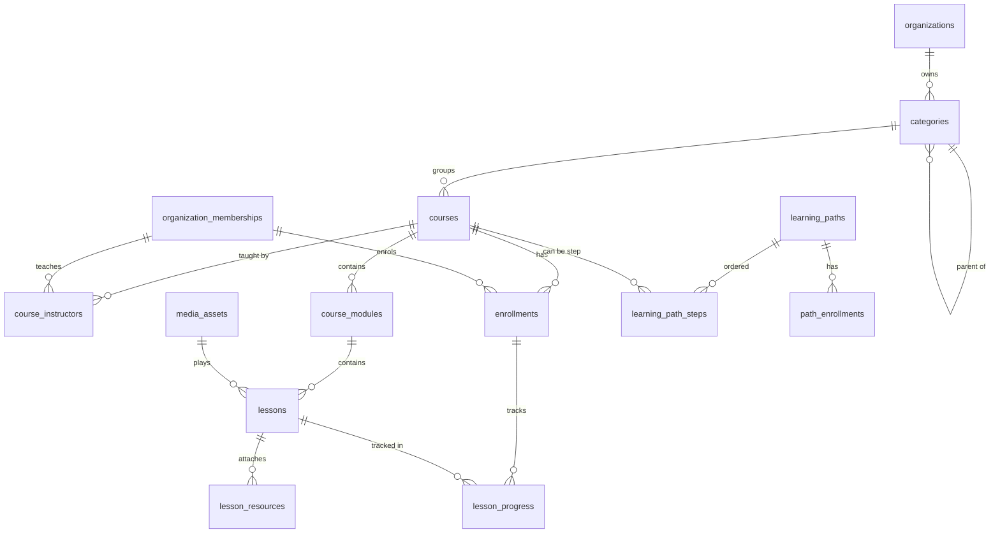
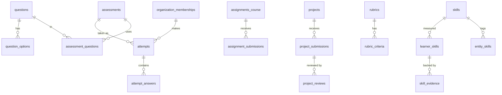
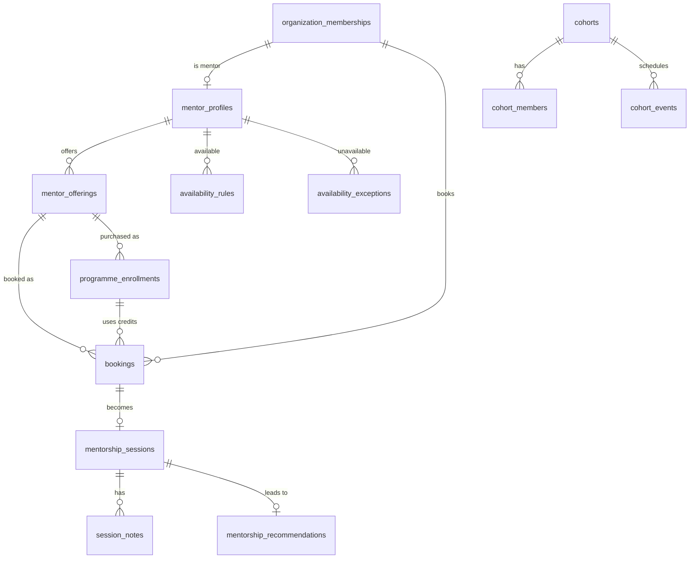
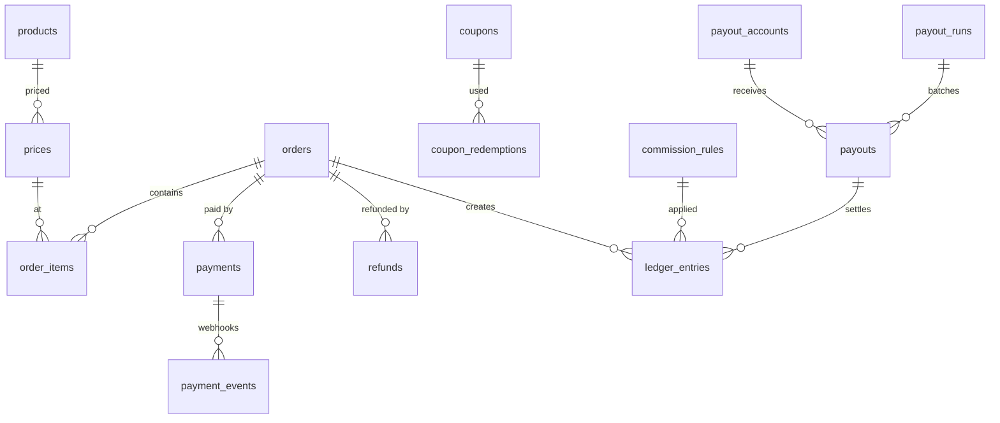

# C. Database ERD

PostgreSQL 16. Diagrams use Mermaid (they render on GitHub). Table definitions follow each diagram.

## C.0 Conventions

| Convention | Rule |
| --- | --- |
| Primary key | `id uuid` (UUIDv7) on every table |
| Tenant key | `organization_id uuid not null references organizations(id)` on every **tenant-owned** table (marked 🏢). RLS policy `organization_id = current_setting('app.current_org_id')::uuid` |
| Global tables | Marked 🌐. No `organization_id`, or nullable where a row can be platform-wide or tenant-specific (marked 🌐/🏢) |
| Timestamps | `created_at`, `updated_at timestamptz not null default now()`; `deleted_at` where soft delete applies |
| Money | `*_minor bigint` + `currency char(3)` |
| Indexes | Every tenant table: composite indexes start with `organization_id`. Every FK indexed |
| Uniqueness | Tenant-scoped uniqueness includes `organization_id`, e.g. `unique (organization_id, slug)` |
| Composite FKs | Where a child must be in the same tenant as its parent, the FK includes the tenant: `foreign key (organization_id, course_id) references courses (organization_id, id)`. This makes cross-tenant links **impossible at database level**, not just unlikely |

**Mapping to the master prompt's entity list:** `learners`, `instructors`, `mentors`, `experts` → roles on `organization_memberships` plus profile tables (`instructor_profiles`, `mentor_profiles`, `expert_profiles`). `answers` → `question_options` (possible answers) + `attempt_answers` (given answers). `certifications` → `external_certifications` (learner-uploaded, e.g. AZ-104). `credentials` → `credentials` (issued by the academy). `mentorship_profiles` → `mentor_profiles`. `transactions` → `payments` + `ledger_entries`. Everything else keeps its name.

---

## C.1 Platform, identity and access



| Table | Scope | Key columns | Constraints / indexes |
| --- | --- | --- | --- |
| `organizations` | 🌐 | id, name, slug, type (`flagship`,`training`,`company`,`university`,`community`), status (`trial`,`active`,`past_due`,`suspended`,`cancelled`), country_code, default_currency, timezone, data_region, cert_prefix, created_by_user_id | unique(slug) |
| `domains` | 🌐 | id, organization_id FK, hostname, type (`platform_subdomain`,`custom`), is_primary, verification_status, verification_token, ssl_status, verified_at | unique(hostname) |
| `organization_branding` | 🏢 | organization_id PK/FK, logo_asset_id, favicon_asset_id, color_primary, color_accent, font_heading, font_body, email_from_name, landing_page jsonb, nav jsonb, hide_powered_by | |
| `organization_settings` | 🏢 | organization_id PK/FK, settings jsonb (schema-validated: signup mode, terminology, mentorship rules, commission defaults, certificate rules) | |
| `feature_flags` | 🌐/🏢 | id, key, organization_id nullable, enabled, rollout_percent | unique(key, organization_id) |
| `plans` | 🌐 | id, code (`starter`,`professional`,`enterprise`,`flagship`), name, is_public, prices jsonb per currency & interval, trial_days | unique(code) |
| `plan_features` | 🌐 | id, plan_id FK, feature_key, limit_value bigint null, enabled bool | unique(plan_id, feature_key) |
| `organization_limits` | 🏢 | id, organization_id, feature_key, limit_value, enabled, reason, expires_at | unique(organization_id, feature_key) |
| `subscriptions` | 🌐 (refs tenant) | id, organization_id FK, plan_id FK, status, interval, currency, amount_minor, current_period_start/end, trial_ends_at, cancel_at, provider, provider_subscription_id | index(organization_id, status) |
| `invoices` | 🌐 (refs tenant) | id, organization_id, subscription_id, number, status, subtotal_minor, tax_minor, total_minor, currency, due_at, paid_at, pdf_asset_id | unique(number) |
| `usage_counters` | 🏢 | id, organization_id, metric (`active_learners`,`storage_bytes`,`ai_credits`,`video_minutes`), period (yyyymm), value | unique(organization_id, metric, period) |
| `users` | 🌐 | id, email (citext), email_verified_at, password_hash nullable, name, avatar_asset_id, locale, timezone, status, last_login_at | unique(email) |
| `user_identities` | 🌐 | id, user_id FK, provider (`google`,`microsoft`,`saml:{org}`), provider_subject | unique(provider, provider_subject) |
| `user_mfa_factors` | 🌐 | id, user_id, type (`totp`,`webauthn`), secret_encrypted, confirmed_at | |
| `sessions` | 🌐 | id, user_id, ip, user_agent, last_active_at, revoked_at | (Redis primary; DB copy for listing) |
| `platform_staff` | 🌐 | id, user_id FK unique, role (`super_admin`,`support`,`finance`,`readonly`), mfa_required | |
| `organization_memberships` | 🏢 | id, organization_id, user_id FK, status (`invited`,`active`,`suspended`,`left`), managed_by_org bool, joined_at, title, metadata jsonb | unique(organization_id, user_id) |
| `permissions` | 🌐 | id, key (`courses.publish`), module, description | unique(key) |
| `roles` | 🌐/🏢 | id, organization_id nullable (null = system role), key, name, is_system | unique(organization_id, key) |
| `role_permissions` | 🌐/🏢 | role_id, permission_id, scope (`own`,`team`,`org`,`platform`) | pk(role_id, permission_id) |
| `membership_roles` | 🏢 | organization_id, membership_id, role_id | pk(membership_id, role_id) |
| `invitations` | 🏢 | id, organization_id, email, role_ids uuid[], org_unit_id null, token_hash, invited_by, expires_at, accepted_at | index(organization_id, email) |

---

## C.2 Catalog and learning



| Table | Scope | Key columns | Constraints / indexes |
| --- | --- | --- | --- |
| `categories` | 🏢 | id, organization_id, parent_id null, name, slug, icon, position | unique(organization_id, slug) |
| `courses` | 🏢 | id, organization_id, category_id, title, slug, subtitle, description (rich), outcomes jsonb, prerequisites jsonb, level (`beginner`…`expert`), language, est_duration_minutes, thumbnail_asset_id, status (`draft`,`in_review`,`published`,`archived`), visibility (`public`,`members`,`private`), is_free, published_at, version, created_by | unique(organization_id, slug); index(organization_id, status, category_id) |
| `course_instructors` | 🏢 | organization_id, course_id, membership_id, role (`owner`,`co_instructor`), revenue_share_bps | pk(course_id, membership_id) |
| `course_modules` | 🏢 | id, organization_id, course_id, title, position, is_required | index(course_id, position) |
| `lessons` | 🏢 | id, organization_id, module_id, course_id, type (`video`,`audio`,`text`,`pdf`,`file`,`link`,`embed`,`quiz`,`assignment`), title, content jsonb, media_asset_id, assessment_id null, assignment_id null, duration_seconds, is_preview, is_required, position | index(module_id, position) |
| `lesson_resources` | 🏢 | id, organization_id, lesson_id, type (`file`,`link`), title, asset_id, url | |
| `media_assets` | 🏢 | id, organization_id, kind (`image`,`video`,`audio`,`document`), storage (`r2`,`stream`), storage_key, provider_asset_id, mime_type, size_bytes, duration_seconds, status (`uploading`,`scanning`,`processing`,`ready`,`failed`,`quarantined`), captions_asset_id, uploaded_by | index(organization_id, status) |
| `enrollments` | 🏢 | id, organization_id, course_id, membership_id, source (`purchase`,`free`,`coupon`,`assignment`,`cohort`,`path`,`admin_grant`,`subscription`), source_ref_id, status (`active`,`completed`,`revoked`,`expired`), enrolled_at, completed_at, expires_at | unique(organization_id, course_id, membership_id) |
| `lesson_progress` | 🏢 | id, organization_id, enrollment_id, lesson_id, status (`not_started`,`in_progress`,`completed`), percent, last_position_seconds, completed_at, time_spent_seconds | unique(enrollment_id, lesson_id) |
| `course_progress` | 🏢 | enrollment_id PK, organization_id, completed_items, total_items, percent, last_lesson_id, last_accessed_at | |
| `learning_paths` 🔵P2 | 🏢 | id, organization_id, title, slug, description, level, status, completion_rule jsonb, credential_template_id, is_free | unique(organization_id, slug) |
| `learning_path_steps` 🔵P2 | 🏢 | id, organization_id, path_id, type (`course`,`assessment`,`project`,`mentorship`,`cohort`,`external`), ref_id, title, is_required, prerequisite_step_ids uuid[], position | |
| `path_enrollments` 🔵P2 | 🏢 | id, organization_id, path_id, membership_id, source, status, progress_percent, due_at, completed_at, path_version | unique(path_id, membership_id) |
| `path_step_progress` 🔵P2 | 🏢 | path_enrollment_id, step_id, status, completed_at | pk(path_enrollment_id, step_id) |

---

## C.3 Assessments, projects and skills



| Table | Scope | Key columns |
| --- | --- | --- |
| `assessments` | 🏢 | id, organization_id, course_id null, type (`quiz`,`exam`,`skill`,`practical`), title, instructions, pass_mark_percent, max_attempts, time_limit_seconds, shuffle_questions, shuffle_options, show_answers (`never`,`after_submit`,`after_pass`), selection jsonb (P2 pools), status |
| `questions` | 🏢 | id, organization_id, course_id null, type (`mcq`,`multi_select`,`true_false`,`short_answer`,`essay`,`scenario`,`practical`), stem jsonb, explanation jsonb, points, difficulty, answer_config jsonb (keywords, case sensitivity), rubric_id null, status |
| `question_options` | 🏢 | id, organization_id, question_id, label jsonb, is_correct, position |
| `assessment_questions` | 🏢 | assessment_id, question_id, position, points_override |
| `attempts` | 🏢 | id, organization_id, assessment_id, membership_id, enrollment_id null, attempt_number, status (`in_progress`,`submitted`,`awaiting_grading`,`graded`,`expired`), started_at, submitted_at, deadline_at, score_points, max_points, score_percent, passed, skill_breakdown jsonb, graded_by, graded_at · unique(assessment_id, membership_id, attempt_number) |
| `attempt_answers` | 🏢 | id, organization_id, attempt_id, question_id, question_snapshot jsonb, response jsonb, is_correct, points_awarded, feedback, graded_by |
| `assignments_course` | 🏢 | id, organization_id, course_id, lesson_id, instructions, submission_types text[], max_points, due_offset_days |
| `assignment_submissions` | 🏢 | id, organization_id, assignment_id, membership_id, text, asset_ids uuid[], url, status, score, feedback, graded_by, graded_at |
| `rubrics` 🔵P2 | 🏢 | id, organization_id, title; `rubric_criteria`: id, rubric_id, title, levels jsonb (label, points, descriptor) |
| `projects` 🔵P2 | 🏢 | id, organization_id, course_id null, path_id null, title, brief jsonb, resources jsonb, submission_types text[], rubric_id, due_offset_days, reviewer_mode (`manual`,`round_robin`,`instructor`) |
| `project_submissions` 🔵P2 | 🏢 | id, organization_id, project_id, membership_id, version, text, repo_url, live_url, asset_ids uuid[], status (`submitted`,`in_review`,`changes_requested`,`approved`,`rejected`), reviewer_membership_id, submitted_at |
| `project_reviews` 🔵P2 | 🏢 | id, organization_id, submission_id, reviewer_membership_id, rubric_scores jsonb, total_score, decision, feedback, created_at |
| `skills` 🔵P2 | 🌐/🏢 | id, organization_id null (null = platform taxonomy), parent_id (domain), name, slug, description, level_descriptors jsonb |
| `entity_skills` 🔵P2 | 🏢 | organization_id, skill_id, entity_type (`course`,`assessment`,`question`,`project`,`credential_template`), entity_id, target_level |
| `learner_skills` 🔵P2 | 🏢 | id, organization_id, membership_id, skill_id, computed_level, self_reported_level, mentor_verified_level, confidence, last_computed_at · unique(membership_id, skill_id) |
| `skill_evidence` 🔵P2 | 🏢 | id, organization_id, learner_skill_id, type (`course_completion`,`assessment_score`,`project_approved`,`credential`,`external_cert`,`mentor_verification`), ref_id, level_signal, weight, verified, created_at |
| `external_certifications` 🔵P2 | 🏢 | id, organization_id, membership_id, name (e.g. "AZ-104"), issuer, credential_id, credential_url, issued_on, expires_on, asset_id, verification_status (`unverified`,`admin_verified`,`issuer_verified`) |

**Skill level computation (P2), documented rule:** the computed level is the highest level for which the learner has *at least two independent pieces of verified evidence*, one of which must be an assessment score ≥ 70% or an approved project at that target level; mentor verification can confirm but not alone raise more than one level. Self-reported level is stored separately and never shown as verified.

---

## C.4 Mentorship and cohorts



| Table | Scope | Key columns |
| --- | --- | --- |
| `mentor_profiles` | 🏢 | id, organization_id, membership_id unique, handle, headline, bio, expertise_skill_ids uuid[], industries text[], years_experience, languages text[], links jsonb, intro_video_asset_id, timezone, meeting_link_encrypted, status (`applied`,`approved`,`paused`,`suspended`), offers_free_intro, rating_avg, rating_count, reliability_score |
| `mentor_offerings` | 🏢 | id, organization_id, mentor_profile_id, type (`free_intro`,`single_session`,`monthly`,`programme`,`group_session`), title, description, duration_minutes, session_count, weeks, price_minor, currency, includes jsonb, capacity (group), status |
| `availability_rules` | 🏢 | id, organization_id, mentor_profile_id, weekday, start_time, end_time, timezone |
| `availability_exceptions` | 🏢 | id, organization_id, mentor_profile_id, starts_at, ends_at, reason |
| `bookings` | 🏢 | id, organization_id, offering_id, mentor_profile_id, learner_membership_id, programme_enrollment_id null, order_id null, starts_at, ends_at, status (`held`,`confirmed`,`cancelled`,`rescheduled`,`completed`,`no_show_learner`,`no_show_mentor`), hold_expires_at, learner_goal, cancelled_by, cancel_reason · **exclusion constraint**: no overlapping `tstzrange(starts_at, ends_at)` for the same mentor where status in (held, confirmed) |
| `mentorship_sessions` | 🏢 | id, organization_id, booking_id unique, held_at, meeting_url, outcome, learner_rating, mentor_rating_of_learner (private), duration_actual |
| `session_notes` | 🏢 | id, organization_id, session_id, author_membership_id, visibility (`private`,`shared`), body |
| `mentorship_recommendations` | 🏢 | id, organization_id, session_id, mentor_profile_id, learner_membership_id, goal_summary, items jsonb (type, ref_id, price_minor, discount), personal_note, status (`sent`,`viewed`,`accepted`,`expired`,`withdrawn`), expires_at, viewed_at, accepted_order_id |
| `mentorship_programmes` | 🏢 | id, organization_id, title, description, weeks, session_count, includes jsonb, price_minor, currency, created_by (mentor or admin) — reusable programme templates that offerings can reference |
| `programme_enrollments` | 🏢 | id, organization_id, offering_id, mentor_profile_id, learner_membership_id, order_id, sessions_total, sessions_used, status, starts_on, ends_on |
| `mentorship_goals` 🔵P2 | 🏢 | id, organization_id, programme_enrollment_id, title, target_date, status, progress_note |
| `cohorts` 🔵P2 | 🏢 | id, organization_id, title, slug, course_id null, path_id null, starts_on, ends_on, capacity, price_minor, currency, status (`draft`,`open`,`full`,`running`,`completed`), application_required, completion_rule jsonb |
| `cohort_members` 🔵P2 | 🏢 | id, organization_id, cohort_id, membership_id, role (`learner`,`instructor`,`mentor`,`ta`), status (`applied`,`waitlisted`,`enrolled`,`completed`,`dropped`) · unique(cohort_id, membership_id) |
| `cohort_events` 🔵P2 | 🏢 | id, organization_id, cohort_id, type (`live_session`,`deadline`,`office_hours`), title, starts_at, ends_at, meeting_url, recording_asset_id |
| `attendance` 🔵P2 | 🏢 | cohort_event_id, membership_id, status, joined_at |

---

## C.5 Credentials and profiles

| Table | Scope | Key columns |
| --- | --- | --- |
| `credential_templates` | 🏢 | id, organization_id, type (`certificate`,`badge`), name, html_template_key, design jsonb (logo, colours, signatories), validity_months null |
| `credentials` | 🏢 | id, organization_id, type, template_id, membership_id, user_id (for portability), source_type (`course`,`path`,`cohort`,`assessment`,`manual`), source_id, code, verification_token_hash, recipient_name, title, issuer_name, completed_on, issued_at, expires_at, status (`issued`,`revoked`,`expired`,`superseded`), revoked_reason, content_hash, signature, pdf_asset_id · unique(code); unique(organization_id, membership_id, source_type, source_id, status='issued') partial |
| `credential_events` | 🏢 | id, organization_id, credential_id, type (`issued`,`viewed`,`verified`,`shared`,`revoked`), country_code, referrer_host, created_at |
| `credential_verification_index` | 🌐 | code PK, credential_id, organization_id, status, recipient_name, title, issuer_name, issued_at, expires_at, revoked_reason — a **minimal, public-safe copy** that keeps verification working even if the tenant leaves |
| `professional_profiles` 🔵P2 | 🌐 (user-owned) | id, user_id unique, handle unique, headline, summary, location, availability, links jsonb, is_public |
| `profile_items` 🔵P2 | 🏢 | id, organization_id, profile_id, type (`skill`,`credential`,`project`,`course`,`experience`,`recommendation`), ref_id, visibility (`public`,`academy`,`private`), position — tenant-sourced items stay tenant-owned; the learner chooses to show them |
| `talent_consents` 🔵P3 | 🏢 | id, organization_id, membership_id, discoverable, fields jsonb, consented_at, withdrawn_at |
| `contact_requests` 🔵P3 | 🏢 | id, organization_id, recruiter_membership_id, learner_membership_id, message, status (`pending`,`accepted`,`declined`,`expired`), responded_at |

---

## C.6 Commerce, payments, payouts and billing



| Table | Scope | Key columns |
| --- | --- | --- |
| `products` | 🏢 | id, organization_id, type (`course`,`path`,`mentor_offering`,`cohort`,`expert_service`,`subscription`,`seat_pack`), ref_id, seller_membership_id null (null = tenant itself), title, status |
| `prices` | 🏢 | id, organization_id, product_id, currency, amount_minor, interval null (`month`,`year` for subscriptions), active, starts_at, ends_at |
| `orders` | 🏢 | id, organization_id, number, buyer_membership_id, buyer_org_unit_id null, status (`pending`,`paid`,`failed`,`cancelled`,`refunded`,`partially_refunded`), currency, subtotal_minor, discount_minor, tax_minor, total_minor, coupon_id, utm jsonb, paid_at · unique(organization_id, number) |
| `order_items` | 🏢 | id, organization_id, order_id, product_id, price_id, title_snapshot, quantity, unit_amount_minor, discount_minor, total_minor, seller_membership_id |
| `coupons` | 🏢 | id, organization_id, code, type (`percent`,`fixed`), value, currency, max_redemptions, per_user_limit, applies_to jsonb, starts_at, ends_at, active · unique(organization_id, upper(code)) |
| `coupon_redemptions` | 🏢 | id, organization_id, coupon_id, order_id, membership_id |
| `payment_provider_accounts` | 🏢 | id, organization_id, provider, mode (`platform`,`connected`), external_account_id, credentials_encrypted null, status, currencies text[] |
| `payments` | 🏢 | id, organization_id, order_id null, invoice_id null, provider, provider_reference, idempotency_key, status (`initiated`,`pending`,`succeeded`,`failed`,`refunded`), amount_minor, currency, fee_minor, channel (`card`,`bank_transfer`,`ussd`…), paid_at · unique(provider, provider_reference); unique(idempotency_key) |
| `payment_events` | 🌐 | id, provider, event_id, event_type, payload jsonb, signature_valid, organization_id null, processed_at, error · unique(provider, event_id) |
| `refunds` | 🏢 | id, organization_id, order_id, payment_id, amount_minor, reason, status, provider_reference, created_by |
| `commission_rules` | 🌐/🏢 | id, organization_id null (null = platform default), product_type, seller_membership_id null, category_id null, platform_bps, tenant_bps, seller_bps, fee_bearer (`platform`,`seller`,`split`), starts_at, ends_at, priority |
| `ledger_entries` | 🏢 | id, organization_id, account (`seller:{membership}`, `tenant`, `platform`, `processor_fees`, `tax`), order_id, order_item_id, refund_id, payout_id, direction (`credit`,`debit`), amount_minor, currency, status (`pending`,`available`,`paid`,`reversed`), available_at, created_at — **append-only** |
| `payout_accounts` | 🏢 | id, organization_id, membership_id, provider, bank_code, account_number_last4, account_name, recipient_code, currency, verified_at, status |
| `payout_runs` | 🏢 | id, organization_id, period_start, period_end, status (`draft`,`approved`,`processing`,`completed`,`failed`), approved_by, approved_at, total_minor, currency |
| `payouts` | 🏢 | id, organization_id, payout_run_id, payout_account_id, membership_id, amount_minor, currency, status, provider_transfer_ref, failure_reason, paid_at |
| `seat_allocations` 🔵P2 | 🏢 | id, organization_id, org_unit_id, product_id null, seats_purchased, seats_used, starts_on, ends_on |

---

## C.7 Corporate, community, notifications, analytics, AI, audit

| Table | Scope | Key columns |
| --- | --- | --- |
| `org_units` 🔵P2 | 🏢 | id, organization_id, parent_id, type (`department`,`team`,`client_account`,`faculty`,`class`), name, code, path ltree (fast subtree queries) |
| `org_unit_members` 🔵P2 | 🏢 | org_unit_id, membership_id, is_manager · pk(org_unit_id, membership_id) |
| `assignments` 🔵P2 | 🏢 | id, organization_id, item_type (`course`,`path`,`assessment`,`mentor_programme`), item_id, assignee_type (`membership`,`org_unit`), assignee_id, due_at, is_required, assigned_by, recurrence (compliance) |
| `assignment_targets` 🔵P2 | 🏢 | id, organization_id, assignment_id, membership_id, status (`assigned`,`in_progress`,`completed`,`overdue`), completed_at |
| `reviews` | 🏢 | id, organization_id, target_type (`course`,`mentor`,`session`,`expert_service`), target_id, author_membership_id, rating 1–5, body, status (`published`,`hidden`), verified_purchase · unique(target_type, target_id, author_membership_id) |
| `seller_applications` | 🏢 | id, organization_id, membership_id, type (`instructor`,`mentor`,`expert`), answers jsonb, status, reviewed_by, decision_note |
| `expert_profiles`, `expert_services`, `service_orders` 🔵P2 | 🏢 | profile, service offer (fixed/quote), order workflow (`requested`,`accepted`,`in_progress`,`delivered`,`approved`,`disputed`) |
| `spaces`, `threads`, `posts`, `moderation_reports` 🔵P2 | 🏢 | community structures (space per course/cohort/group) |
| `notification_templates` | 🌐/🏢 | id, organization_id null, event_key, channel, locale, subject, body |
| `notifications` | 🏢 | id, organization_id, user_id, event_key, title, body, data jsonb, read_at, created_at |
| `notification_deliveries` | 🏢 | id, organization_id, notification_id, channel, provider_message_id, status, attempts, last_error |
| `notification_preferences` | 🏢 | membership_id, event_key, channel, enabled |
| `analytics_events` | 🏢 | id, organization_id, user_id null, name, properties jsonb, occurred_at — **partitioned by month** |
| `daily_aggregates` | 🏢 | organization_id, date, metric, dimension_key, value · pk(organization_id, date, metric, dimension_key) |
| `content_chunks` 🔵P2 | 🏢 | id, organization_id, source_type, source_id, course_id, chunk_index, text, embedding vector(n), token_count, content_hash |
| `ai_conversations`, `ai_messages` 🔵P2 | 🏢 | conversation per membership + context (lesson/course); messages with role, content, citations jsonb, model, tokens |
| `ai_usage` 🔵P2 | 🏢 | id, organization_id, membership_id, feature, provider, model, input_tokens, output_tokens, cost_micro_usd, credits, created_at — partitioned |
| `audit_logs` | 🌐/🏢 | id, organization_id null, actor_user_id, actor_type (`user`,`staff`,`system`,`api_key`), impersonator_user_id null, action, target_type, target_id, changes jsonb (before/after, secrets redacted), ip, user_agent, request_id, created_at — **append-only, partitioned by month** |
| `sequences` | 🏢 | organization_id, name (`certificate`,`order`,`invoice`), year, next_value · pk(organization_id, name, year) |

---

## C.8 Tenant boundaries summary

```text
┌───────────────────────────── GLOBAL (platform) ─────────────────────────────┐
│ users · user_identities · user_mfa_factors · platform_staff · organizations │
│ domains · plans · plan_features · subscriptions · invoices · permissions    │
│ system roles · platform skills taxonomy · payment_events (raw webhooks)     │
│ credential_verification_index · professional_profiles (user-owned)          │
└──────────────────────────────────────┬──────────────────────────────────────┘
                                       │ organization_id
┌──────────────────────────── TENANT-OWNED (RLS) ─────────────────────────────┐
│ memberships · custom roles · categories · courses · modules · lessons ·     │
│ media · enrollments · progress · paths · assessments · questions · attempts │
│ projects · submissions · skills (tenant) · learner skills · evidence ·      │
│ mentor profiles · offerings · bookings · sessions · recommendations ·       │
│ cohorts · credentials · products · prices · orders · payments · ledger ·    │
│ payouts · coupons · reviews · org units · assignments · notifications ·     │
│ analytics · AI content & usage · tenant audit logs                          │
└─────────────────────────────────────────────────────────────────────────────┘
```

Crossing the boundary is allowed in only three controlled places:
1. **Identity:** a `user` links to memberships in many tenants (each tenant sees only its own membership).
2. **Public profile:** the learner chooses which tenant-owned items appear on their user-owned profile.
3. **Verification index:** minimal public copy of credentials.

All other cross-tenant reads happen only through the platform-admin database role, which is audited.
